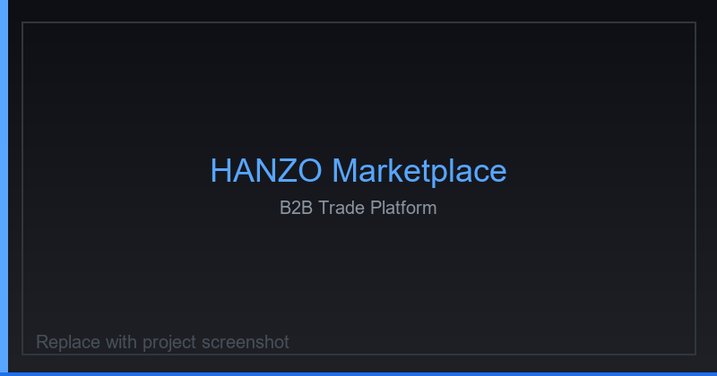
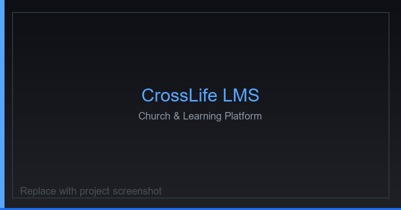
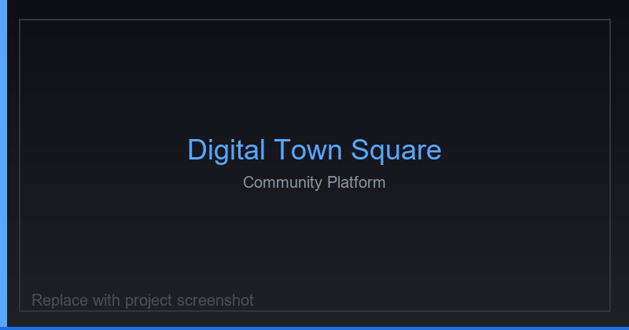
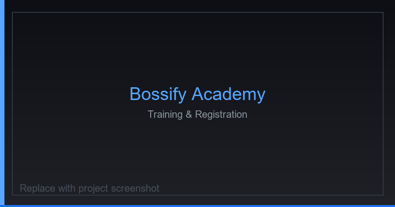
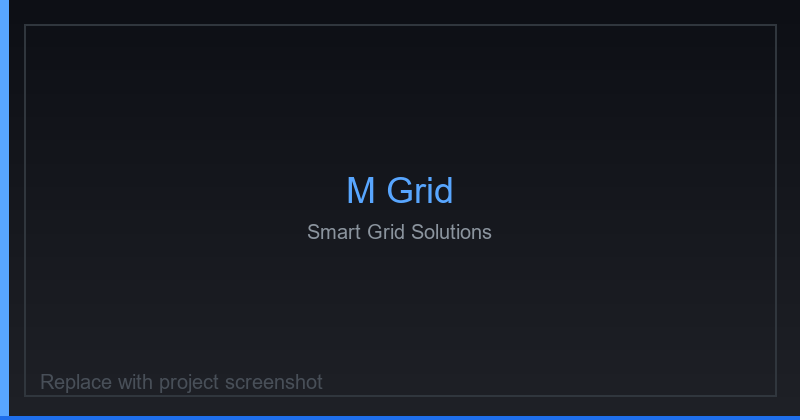
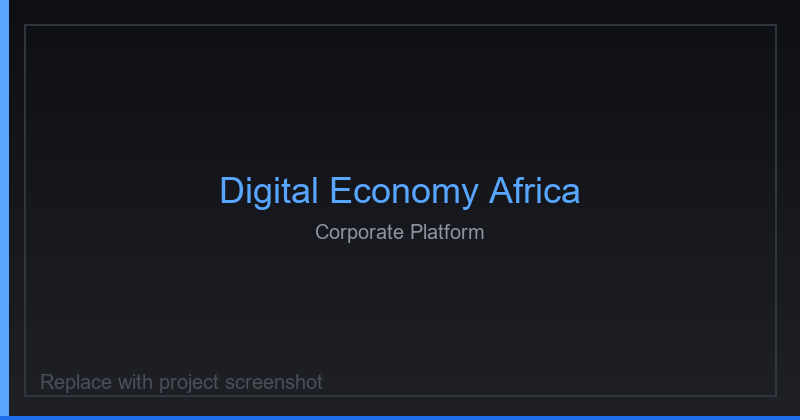
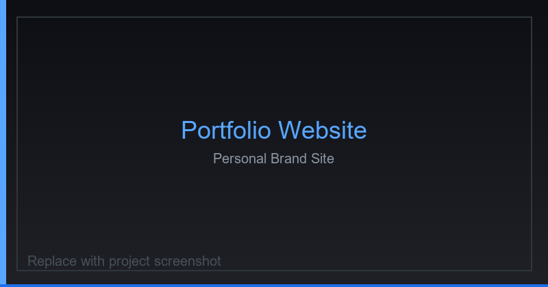

<!--
  ╔══════════════════════════════════════════════════════════════╗
  ║  GitHub Profile README — Valence Mwigani                     ║
  ║  Username: PHENOMVALENCE                                     ║
  ║  Theme: GitHub Dark Blue (#58A6FF / #0d1117)                 ║
  ║  Update guide: docs/PROFILE_GUIDE.md                         ║
  ╚══════════════════════════════════════════════════════════════╝
-->

<!-- ════════════════════════════════════════════════════════════
     SECTION 1 — HERO
     ════════════════════════════════════════════════════════════ -->

  

# Hi 👋 I'm **Valence Mwigani**

### Full Stack Software Engineer · Backend Developer · Technical Leader

  Computer Engineering student and Full Stack Software Engineer based in
  <b>Dar es Salaam, Tanzania</b> — designing scalable platforms, AI-powered products,
  and digital systems that solve real-world problems.

  
  
  
  

  
  
  
  

---

<!-- ════════════════════════════════════════════════════════════
     SECTION 2 — ABOUT ME
     ════════════════════════════════════════════════════════════ -->

## About Me

| | |
|:---|:---|
| 🎓 | **Computer Engineering Student** — Dar es Salaam Institute of Technology |
| 💻 | **Full Stack Software Engineer** — Laravel, Next.js, Spring Boot, React |
| ⚙️ | Passionate about **scalable systems**, clean architecture & production delivery |
| 🤖 | Exploring **AI, Machine Learning, Cloud & DevOps** |
| 🌍 | Building software that solves **real-world African problems** |
| 🤝 | Open to **collaboration**, consulting & open-source contributions |

 

I'm a Full Stack Software Engineer and Technical Leader with **3+ years** of experience building B2B marketplaces, learning platforms, corporate systems, and AI-powered products. I work across the full lifecycle — requirements, architecture, backend APIs, frontend delivery, cloud deployment, and long-term maintenance.

---

<!-- ════════════════════════════════════════════════════════════
     SECTION 3 — CURRENT FOCUS
     ════════════════════════════════════════════════════════════ -->

## Currently Working On

| Status | Focus Area |
|:------:|:-----------|
| ✔ | **AI & Machine Learning** |
| ✔ | **NLP** |
| ✔ | **Computer Vision** |
| ✔ | **React** |
| ✔ | **Laravel** |
| ✔ | **Spring Boot** |
| ✔ | **Next.js** |
| ✔ | **Mobile Money APIs** |
| ✔ | **REST APIs** |
| ✔ | **Android Development** |

---

<!-- ════════════════════════════════════════════════════════════
     SECTION 4 — TECH STACK
     ════════════════════════════════════════════════════════════ -->

## Tech Stack

<b>Languages</b>

 

<b>Frontend</b>

 

<b>Backend</b>

 

<b>Databases</b>

 

<b>AI / ML</b>

 

<b>Tools</b>

 

<b>Cloud</b>

 

---

<!-- ════════════════════════════════════════════════════════════
     SECTION 5 — FEATURED PROJECTS
     Replace placeholders in assets/project-images/ with real screenshots.
     Update live demo / repo links below as needed.
     ════════════════════════════════════════════════════════════ -->

## Featured Projects

<table width="100%">
  <tr>
    <td width="50%" valign="top" align="center">
      
      <h3>Hanzo Marketplace</h3>
      

        Privacy-focused B2B marketplace connecting East African buyers with verified Chinese factories — role-based dashboards, product catalogs, order workflows, analytics, and multi-currency support.
      

      

        
        
        
        
      

      

        
        
      

    </td>
    <td width="50%" valign="top" align="center">
      
      <h3>CrossLife LMS</h3>
      

        Church management and learning platform combining community operations with a full LMS — courses, certificates, events, ministries, materials, and administration.
      

      

        
        
        
        
      

      

        
        
      

    </td>
  </tr>
  <tr>
    <td width="50%" valign="top" align="center">
      
      <h3>Digital Town Square</h3>
      

        Community-driven digital platform for civic engagement, local information sharing, and public discourse — built to strengthen digital participation across African communities.
      

      

        
        
        
      

      

        
        
      

    </td>
    <td width="50%" valign="top" align="center">
      
      <h3>Bossify Academy</h3>
      

        Training and registration platform with participant onboarding, payment verification, SMS notifications, and admin workflows for academy operations.
      

      

        
        
        
        
      

      

        
        
      

    </td>
  </tr>
  <tr>
    <td width="50%" valign="top" align="center">
      
      <h3>M Grid</h3>
      

        Smart-grid oriented web application exploring energy monitoring, grid insights, and data-driven interfaces for modern electricity infrastructure.
      

      

        
        
        
      

      

        
        
      

    </td>
    <td width="50%" valign="top" align="center">
      
      <h3>Digital Economy Africa</h3>
      

        Organizational platform for digital economy initiatives — research, news, events, galleries, and stakeholder engagement with technical SEO and responsive delivery.
      

      

        
        
        
        
      

      

        
        
      

    </td>
  </tr>
  <tr>
    <td colspan="2" valign="top" align="center">
      
      <h3>Portfolio Website</h3>
      

        Personal brand site showcasing engineering work, leadership experience, services, and selected platforms — optimized for performance, SEO, and professional discovery.
      

      

        
        
        
      

      

        
        
      

    </td>
  </tr>
</table>

---

<!-- ════════════════════════════════════════════════════════════
     SECTION 6 — GITHUB STATS
     Theme colors: bg=0d1117, accent=58A6FF
     ════════════════════════════════════════════════════════════ -->

## GitHub Stats

<table>
  <tr>
    <td align="center">
      
    </td>
    <td align="center">
      
    </td>
  </tr>
</table>

  

  

<!-- Contribution Snake — generated by .github/workflows/snake.yml -->

  

<!-- Productivity metrics -->

---

<!-- ════════════════════════════════════════════════════════════
     SECTION 7 — AI & MACHINE LEARNING
     ════════════════════════════════════════════════════════════ -->

## AI & Machine Learning

 

Applied AI work spanning NLP, computer vision, and predictive modeling:

| Project | Domain | Focus |
|:--------|:-------|:------|
| **News Category Classification** | NLP | Multi-class text classification for news content |
| **Spam Detection** | NLP | Classical & modern ML for message filtering |
| **Face Emotion Recognition** | Computer Vision | Facial expression classification pipelines |
| **Crop Recommendation** | ML / AgriTech | Data-driven crop selection models |
| **Electricity Consumption Prediction** | Predictive ML | Household usage forecasting & analysis |

  
  

---

<!-- ════════════════════════════════════════════════════════════
     SECTION 8 — EXPERIENCE
     ════════════════════════════════════════════════════════════ -->

## Experience

<table>
  <tr>
    <td width="28%"><b>Sparkcraft Consulting</b></td>
    <td width="28%"><b>Software Engineer</b></td>
    <td width="44%"><b>2025 – Present</b></td>
  </tr>
  <tr>
    <td colspan="3">
      Lead full-stack delivery of consulting platforms and digital products for African markets. Architected ChargedAfrica (CMS, subscribers, automated email). Own SEO, deployment, and ongoing product performance.
    </td>
  </tr>
  <tr>
    <td><b>Proma Africa</b></td>
    <td><b>Lead Web Developer</b></td>
    <td><b>Mar 2025 – Present</b></td>
  </tr>
  <tr>
    <td colspan="3">
      Engineer the corporate property platform and PHP/MySQL backend for listings, inquiries, and contact management. Drive responsive delivery, performance, technical SEO, and maintenance.
    </td>
  </tr>
  <tr>
    <td><b>Stanbic Bank Tanzania</b></td>
    <td><b>Software Developer — Field Training</b></td>
    <td><b>Aug 2025 – Oct 2025</b></td>
  </tr>
  <tr>
    <td colspan="3">
      Built a Documentation Management Application (Java + Bootstrap) in the Tech & Innovation function. Applied enterprise practices in a regulated banking environment with version-controlled collaboration.
    </td>
  </tr>
  <tr>
    <td><b>AIESEC in Tanzania</b></td>
    <td><b>Project Lead — Youth to Business Forum 2026</b></td>
    <td><b>2026</b></td>
  </tr>
  <tr>
    <td colspan="3">
      Led end-to-end planning and execution of a flagship forum convening innovators, founders, CEOs, policymakers, and investors — spanning partnerships, logistics, program design, and operations.
    </td>
  </tr>
  <tr>
    <td><b>AIESEC in IFM</b></td>
    <td><b>Head of Business Development & Engagement</b></td>
    <td><b>Feb 2026 – Present</b></td>
  </tr>
  <tr>
    <td colspan="3">
      Direct partnership strategy across corporates, government, NGOs, and ecosystem partners. Drive sponsorship and programs including Smart Dada 2026 and Youth Financial Literacy (455+ registrations across 7 universities).
    </td>
  </tr>
</table>

---

<!-- ════════════════════════════════════════════════════════════
     SECTION 9 — CERTIFICATIONS
     Placeholder cards — replace with real cert links when ready.
     ════════════════════════════════════════════════════════════ -->

## Certifications

| Provider | Focus | Status |
|:--------:|:------|:------:|
|  | Cloud · Data · AI | 🔜 Upcoming |
|  | Networking (CCNA foundation) | ✅ In Progress |
|  | Frontend · Full Stack | 🔜 Upcoming |
|  | Azure · Developer | 🔜 Upcoming |
|  | Databases · Java | 🔜 Upcoming |
|  | Cloud Practitioner · Solutions | 🔜 Upcoming |

> Add certificate links in `docs/PROFILE_GUIDE.md` when earned — swap 🔜 for ✅ and link the credential URL.

---

<!-- ════════════════════════════════════════════════════════════
     SECTION 10 — CONNECT
     ════════════════════════════════════════════════════════════ -->

## Connect

  

📍 Dar es Salaam, Tanzania &nbsp;·&nbsp; 📞 +255 753 775 184 &nbsp;·&nbsp; ✉️ mwiganivalence@gmail.com

---

<!-- ════════════════════════════════════════════════════════════
     SECTION 11 — QUOTE
     ════════════════════════════════════════════════════════════ -->

## Quote

### *"Code is the closest thing we have to a superpower — use it to build systems that outlast you."*

---

<!-- ════════════════════════════════════════════════════════════
     SECTION 12 — SUPPORT
     ════════════════════════════════════════════════════════════ -->

## Let's Collaborate

**Open to open-source contributions, engineering collaborations, and consulting opportunities.**

Whether you're building a marketplace, an LMS, an AI product, or a corporate platform — let's ship something meaningful.

 

  

**Thanks for visiting — let's build the future, one commit at a time.**

