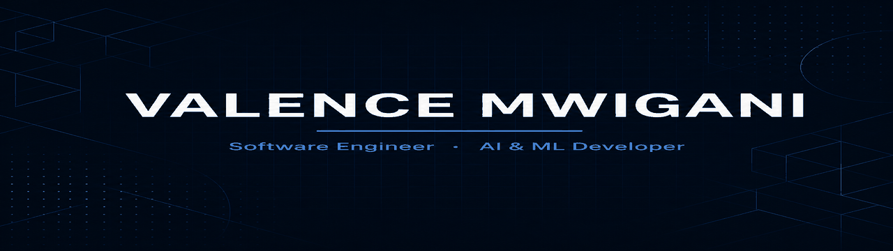
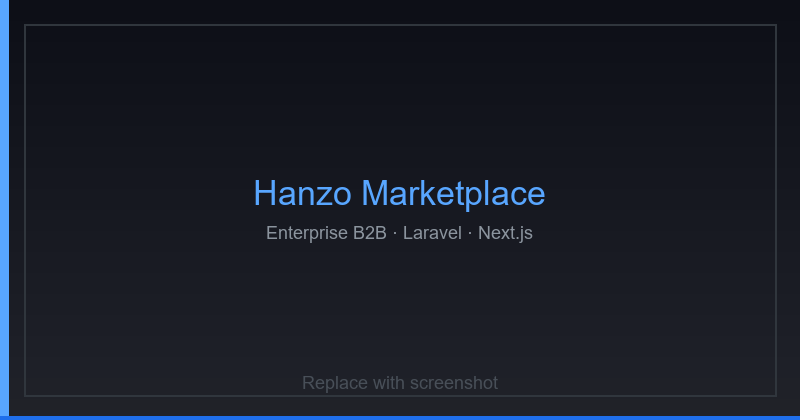
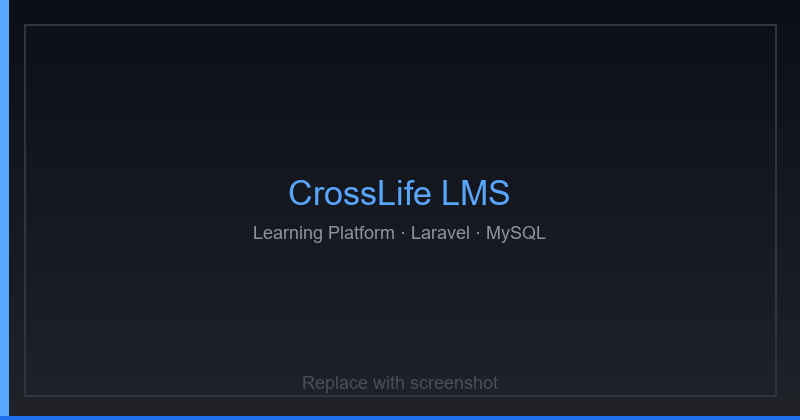
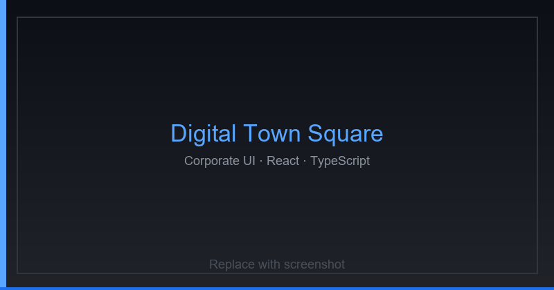
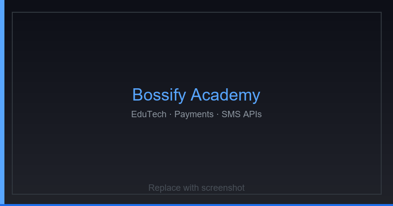
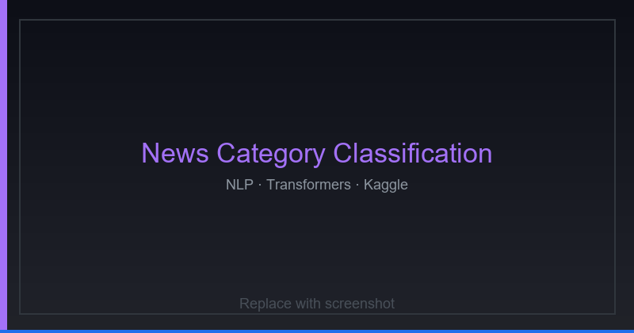
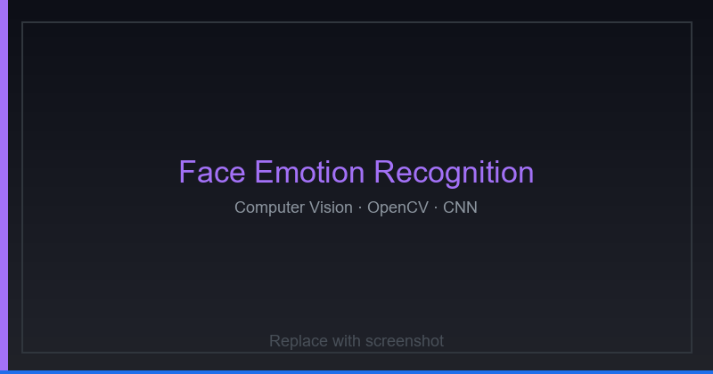
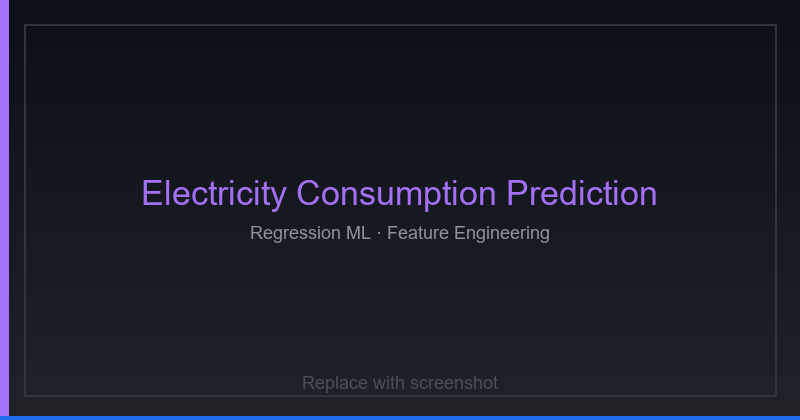

<!--
  ╔══════════════════════════════════════════════════════════════╗
  ║  GitHub Profile — Valence Mwigani                            ║
  ║  Focus: Software Engineer · AI / ML Developer                ║
  ║  Theme: #58A6FF / #0d1117                                    ║
  ║  Guide: docs/PROFILE_GUIDE.md                                ║
  ╚══════════════════════════════════════════════════════════════╝
-->

<div align="center">

<!-- ════════════════════════════════════════════════════════════
     SECTION 1 — HERO
     ════════════════════════════════════════════════════════════ -->



<h1>Hi 👋 I'm Valence Mwigani</h1>

[](https://git.io/typing-svg)

<p>
  Building scalable web apps, production APIs, and AI systems —
  Laravel · Next.js · NLP · Computer Vision
</p>

<p>
  
  &nbsp;
  
  &nbsp;
  
  &nbsp;
  
  &nbsp;
  
</p>

<p>
  <a href="https://valencemwigani.tech"></a>
  <a href="https://github.com/PHENOMVALENCE"></a>
  <a href="https://www.linkedin.com/in/valence-mwigani-a8444031b"></a>
  <a href="mailto:mwiganivalence@gmail.com"></a>
</p>

</div>

---

<!-- ════════════════════════════════════════════════════════════
     SECTION 2 — ABOUT ME
     ════════════════════════════════════════════════════════════ -->

## About Me

<div align="center">

| | |
|:--|:--|
|  | **Computer Engineering Student** at Dar es Salaam Institute of Technology |
|  | Passionate **Full Stack Developer** shipping production web systems |
|  | Building **scalable web applications** and enterprise REST APIs |
|  | Developing **AI-powered solutions** with Python & modern ML stacks |
|  | Focused on **NLP, Computer Vision, and Deep Learning** |
| 🔄 | Always learning modern frameworks, tooling, and engineering practices |

</div>

<br/>

I am a **Software Engineer** and **AI / Machine Learning Developer** specializing in full-stack web development, backend systems, and applied ML. I design and ship Laravel and Next.js applications, Spring Boot services, and practical AI models — with a strong emphasis on clean architecture, reliable APIs, and measurable model performance.

---

<!-- ════════════════════════════════════════════════════════════
     SECTION 3 — CURRENT DEVELOPMENT
     ════════════════════════════════════════════════════════════ -->

## Currently Building

<div align="center">

| | Focus |
|:---:|:------|
| ● | **AI & Machine Learning Projects** |
| ● | **NLP Applications** |
| ● | **Computer Vision Systems** |
| ● | **Laravel APIs** |
| ● | **React Applications** |
| ● | **Spring Boot Backends** |
| ● | **Next.js Projects** |
| ● | **REST APIs** |
| ● | **Hostinger Deployments** |
| ● | **GitHub Automation** |

</div>

---

<!-- ════════════════════════════════════════════════════════════
     SECTION 4 — TECH STACK
     ════════════════════════════════════════════════════════════ -->

## Tech Stack

<details open>
<summary><b>Programming</b></summary>
<br/>
<div align="center">


</div>
</details>

<details open>
<summary><b>Frontend</b></summary>
<br/>
<div align="center">


</div>
</details>

<details open>
<summary><b>Backend</b></summary>
<br/>
<div align="center">


</div>
</details>

<details open>
<summary><b>Artificial Intelligence</b></summary>
<br/>
<div align="center">


</div>
</details>

<details open>
<summary><b>Databases</b></summary>
<br/>
<div align="center">


</div>
</details>

<details open>
<summary><b>Tools</b></summary>
<br/>
<div align="center">


</div>
</details>

<details open>
<summary><b>Cloud</b></summary>
<br/>
<div align="center">


</div>
</details>

---

<!-- ════════════════════════════════════════════════════════════
     SECTION 5 — FEATURED SOFTWARE PROJECTS
     Update cards via docs/PROFILE_GUIDE.md
     ════════════════════════════════════════════════════════════ -->

## Featured Software Projects

<table>
  <tr>
    <td width="50%" valign="top" align="center">
      
      <h3>Hanzo Marketplace</h3>
      <p align="left">
        Enterprise B2B marketplace supporting multilingual products, payments, and supplier management — with role-based dashboards and structured trade workflows.
      </p>
      <p>
        
        
        
        
      </p>
      <p>
        <a href="https://valencemwigani.tech"></a>
        <a href="https://github.com/PHENOMVALENCE"></a>
      </p>
    </td>
    <td width="50%" valign="top" align="center">
      
      <h3>CrossLife LMS</h3>
      <p align="left">
        Learning Management System supporting students, instructors, quizzes, and assignments — built for course delivery, materials, and administration.
      </p>
      <p>
        
        
        
        
      </p>
      <p>
        <a href="https://valencemwigani.tech"></a>
        <a href="https://github.com/PHENOMVALENCE/Learning-Management-System"></a>
      </p>
    </td>
  </tr>
  <tr>
    <td width="50%" valign="top" align="center">
      
      <h3>Digital Town Square</h3>
      <p align="left">
        Corporate website redesigned with modern UI, responsive layouts, and optimized deployment — TypeScript-first React with Tailwind.
      </p>
      <p>
        
        
        
      </p>
      <p>
        <a href="https://valencemwigani.tech"></a>
        <a href="https://github.com/PHENOMVALENCE"></a>
      </p>
    </td>
    <td width="50%" valign="top" align="center">
      
      <h3>Bossify Academy</h3>
      <p align="left">
        Educational platform integrating payment gateways, SMS notifications, and enrollment management for training programs.
      </p>
      <p>
        
        
        
        
      </p>
      <p>
        <a href="https://valencemwigani.tech"></a>
        <a href="https://github.com/PHENOMVALENCE"></a>
      </p>
    </td>
  </tr>
</table>

---

<!-- ════════════════════════════════════════════════════════════
     SECTION 6 — AI & MACHINE LEARNING
     ════════════════════════════════════════════════════════════ -->

## AI & Machine Learning

<div align="center">


</div>

<br/>

<table>
  <tr>
    <td width="33%" valign="top" align="center">
      
      <h3>News Category Classification</h3>
      
      
      <p align="left">
        Transformer-based text classification pipeline covering <b>tokenization</b>, <b>preprocessing</b>, <b>training</b>, <b>evaluation</b>, and <b>prediction</b>.
      </p>
    </td>
    <td width="33%" valign="top" align="center">
      
      <h3>Face Emotion Recognition</h3>
      
      
      <p align="left">
        CNN-based emotion recognition with <b>image preprocessing</b>, <b>emotion prediction</b>, and <b>model evaluation</b> using OpenCV.
      </p>
      <p>
        <a href="https://github.com/PHENOMVALENCE/Facial-Emotion-Recognition"></a>
      </p>
    </td>
    <td width="33%" valign="top" align="center">
      
      <h3>Electricity Consumption Prediction</h3>
      
      
      <p align="left">
        Regression pipeline with <b>feature engineering</b>, <b>data cleaning</b>, Random Forest, Decision Tree, Linear Regression, <b>feature importance</b>, and prediction.
      </p>
      <p>
        <a href="https://github.com/PHENOMVALENCE/ElectricityConsumption"></a>
      </p>
    </td>
  </tr>
</table>

### Future AI Projects

<div align="center">


</div>

---

<!-- ════════════════════════════════════════════════════════════
     SECTION 7 — DEVELOPMENT ACTIVITY
     ════════════════════════════════════════════════════════════ -->

## Development Activity

<div align="center">


<br/><br/>

<!-- Snake — generated by .github/workflows/snake.yml → output branch -->


<br/><br/>


<br/><br/>


<br/><br/>


<br/><br/>

[](https://github.com/PHENOMVALENCE?tab=overview)
[](https://github.com/pulls?q=author%3APHENOMVALENCE)
[](https://github.com/PHENOMVALENCE?tab=repositories&sort=updated)

</div>

---

<!-- ════════════════════════════════════════════════════════════
     SECTION 8 — DEVELOPMENT MILESTONES
     ════════════════════════════════════════════════════════════ -->

## Development Milestones

```text
2022 ──●── Started shipping PHP / MySQL web applications
         │
2023 ──●── Built and deployed production Laravel systems
         │
2024 ──●── Designed enterprise REST APIs & multilingual marketplace (Hanzo)
         │
2024 ──●── Built Learning Management System (CrossLife LMS)
         │
2025 ──●── Integrated Mobile Money / Payment & SMS APIs (Bossify Academy)
         │
2025 ──●── Completed Electricity Consumption Prediction (ML regression)
         │
2025 ──●── Developed Face Emotion Recognition (OpenCV / CNN)
         │
2025 ──●── Built News Category Classification (Transformers / NLP)
         │
2025+ ─●── Deployed multiple apps on Hostinger · GitHub automation
         │
 NOW  ──●── Expanding NLP, Computer Vision & Deep Learning projects
```

<div align="center">

| Status | Milestone |
|:------:|:----------|
| ✔ | Built multiple production Laravel systems |
| ✔ | Designed enterprise REST APIs |
| ✔ | Completed AI model for Electricity Consumption Prediction |
| ✔ | Developed News Category Classification model |
| ✔ | Built Face Emotion Recognition model |
| ✔ | Deployed multiple applications on Hostinger |
| ✔ | Integrated Mobile Money APIs |
| ✔ | Built Learning Management System |
| ✔ | Developed multilingual marketplace |

</div>

---

<!-- ════════════════════════════════════════════════════════════
     SECTION 9 — COMMIT HISTORY & CONSISTENCY
     ════════════════════════════════════════════════════════════ -->

## Commit History & Consistency

<div align="center">

<p><b>Daily commits · Activity calendar · Contribution heatmap · Streaks</b></p>


<br/><br/>

<table>
  <tr>
    <td align="center">
      
    </td>
  </tr>
</table>

<br/>

<!-- Dynamic repo / commit / release metrics -->


<br/><br/>

| Metric | Link |
|:-------|:-----|
| **Recent Commits** | [github.com/PHENOMVALENCE](https://github.com/PHENOMVALENCE) |
| **Recent Repositories Updated** | [Repositories](https://github.com/PHENOMVALENCE?tab=repositories&q=&type=&language=&sort=updated) |
| **Recent Releases** | [Releases search](https://github.com/PHENOMVALENCE?tab=repositories) |
| **Repository Activity** | [Overview](https://github.com/PHENOMVALENCE?tab=overview) |

</div>

---

<!-- ════════════════════════════════════════════════════════════
     SECTION 10 — GITHUB STATISTICS
     ════════════════════════════════════════════════════════════ -->

## GitHub Statistics

<div align="center">

<table>
  <tr>
    <td align="center">
      
    </td>
    <td align="center">
      
    </td>
  </tr>
</table>


<br/><br/>

<p>
  
  
  
  
</p>

</div>

---

<!-- ════════════════════════════════════════════════════════════
     SECTION 11 — CONNECT
     ════════════════════════════════════════════════════════════ -->

## Connect

<div align="center">

<a href="https://valencemwigani.tech">
  
</a>
<a href="https://github.com/PHENOMVALENCE">
  
</a>
<a href="https://www.linkedin.com/in/valence-mwigani-a8444031b">
  
</a>
<a href="mailto:mwiganivalence@gmail.com">
  
</a>
<a href="https://valencemwigani.tech">
  
</a>

</div>

---

<!-- ════════════════════════════════════════════════════════════
     SECTION 12 — QUOTE
     ════════════════════════════════════════════════════════════ -->

## Quote

<div align="center">

### *"Consistency compounds into mastery. Every commit is a step toward excellence."*

<br/>


**Thanks for visiting — let's build reliable software and intelligent systems.**

</div>
